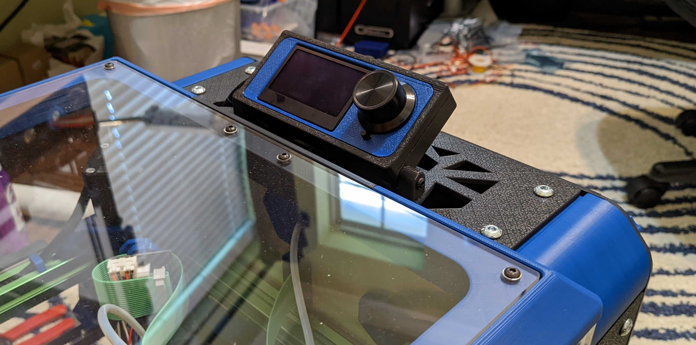
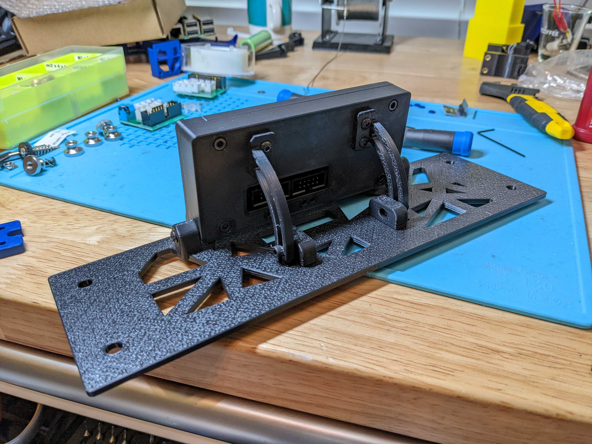
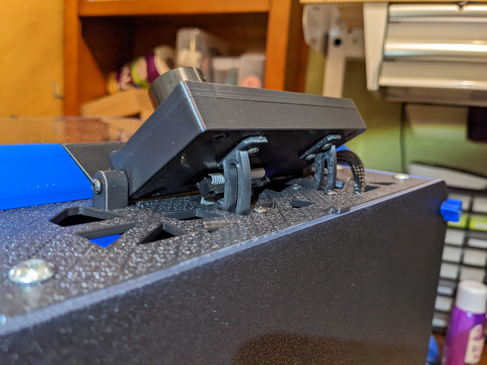
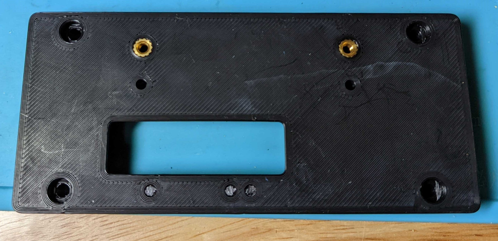
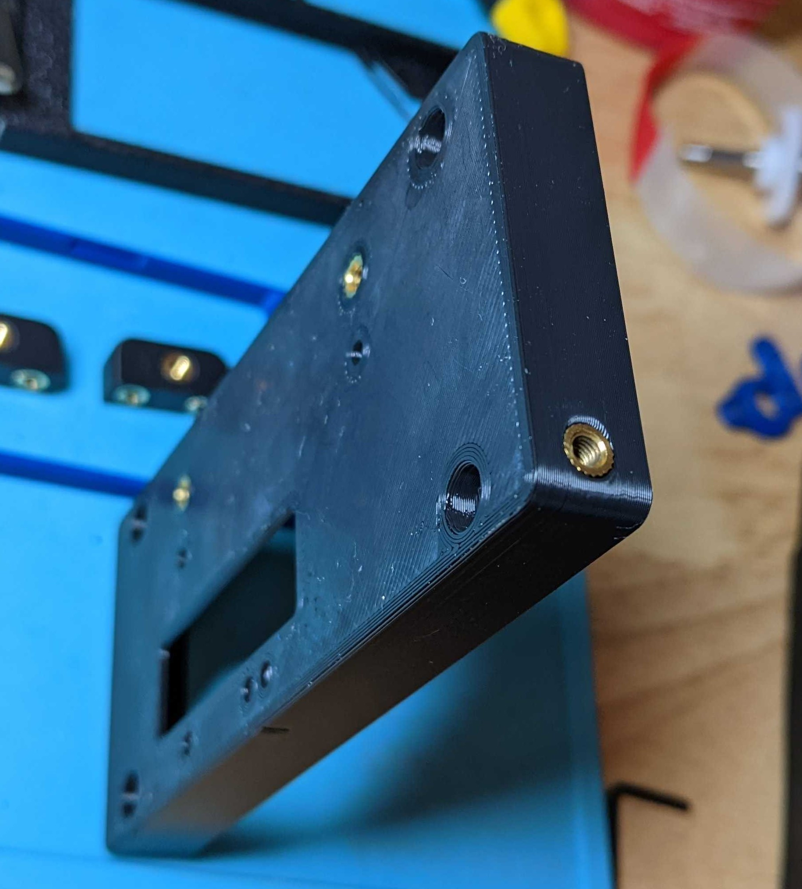
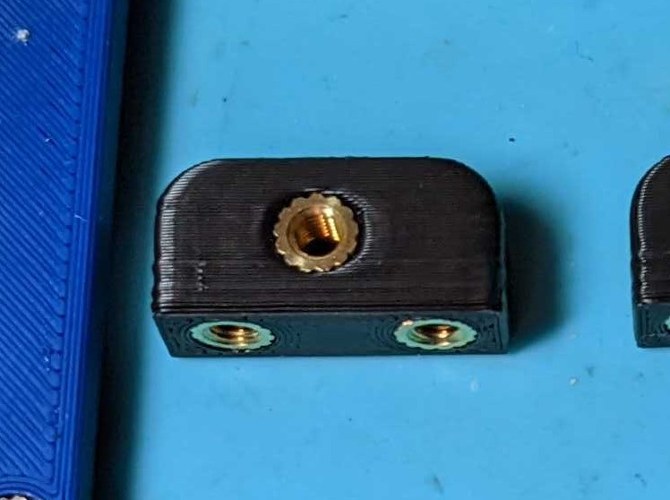
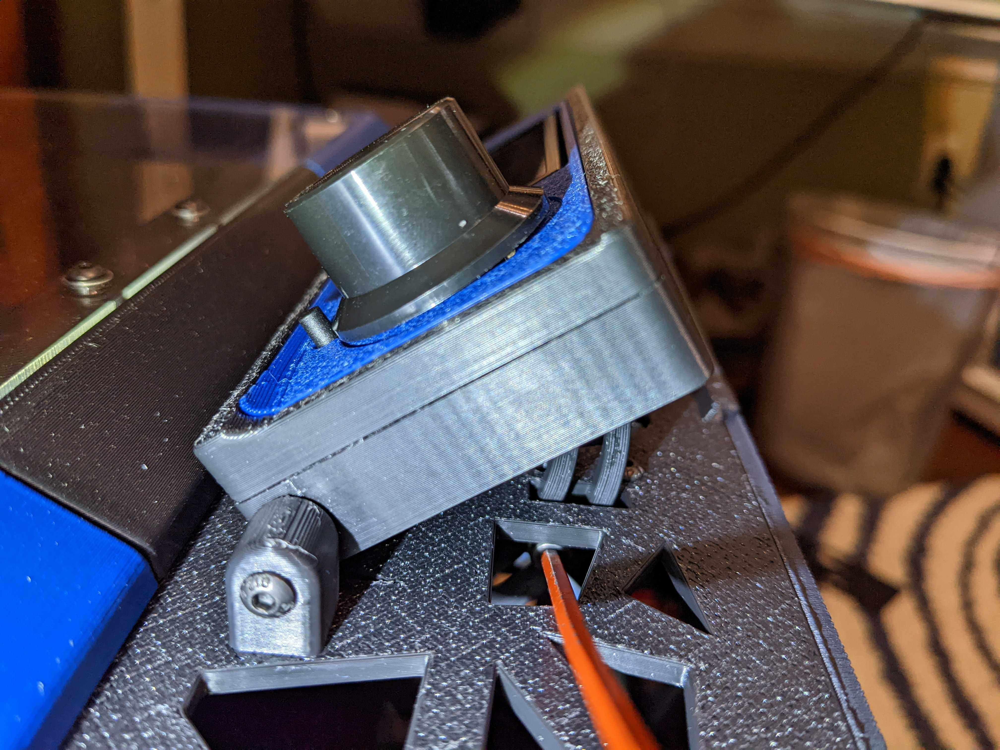
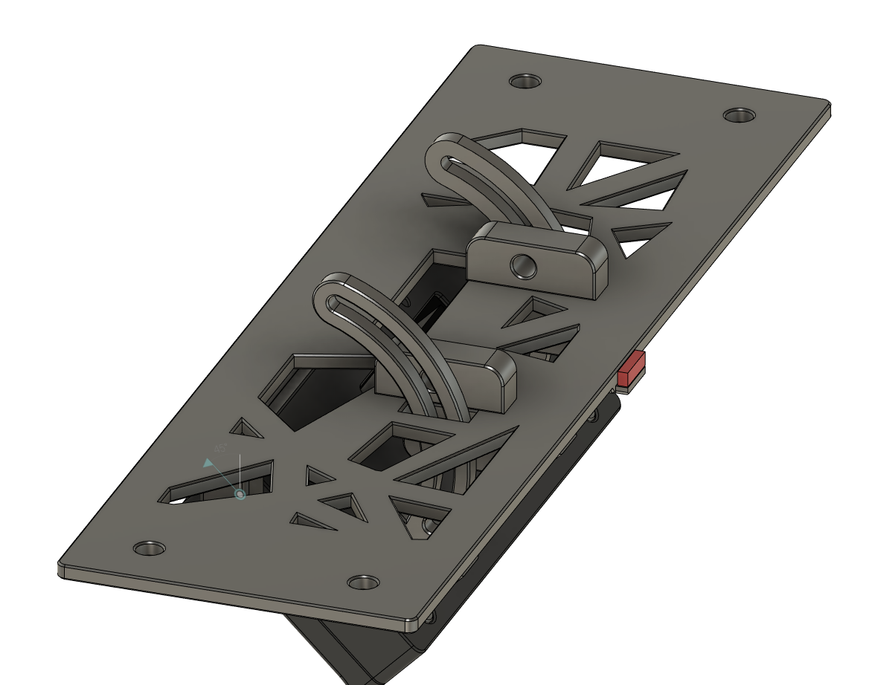

 K3 12864 Tiltable Backpack Mount
============

**NOTE:  Be aware of your material shrinkage**.  This is important for the top lid piece which may be too small if not scaled up.  I generally scale up to 100.58 for ABS and 100.45 for ASA.  

<TABLE width=100%>
<TR>
<TD width=50% align=center> Top mounted clamps all you to tilt all the way to 90 degrees, but will not tilt as flat.</TD>
<TD width=50% align=center> Under mounted clamps will tilt almost flat, but not quite to 90 degrees.</TD>
</TR>
<TR>
<TD width=50% align=center></TD>
<TD width=50% align=center></TD>
</TR>
<TR>
<TD width=50% align=center></TD>
<TD width=50% align=center> You can reach the tightening bolts from above the lid.</TD>
</TR>
<TR>
<TD width=50% align=center> Remove the red support piece</TD>
<TD></TD>
</TR>
</TABLE>

 - Notes
	 - Don't forget to account for your material shrinkage.  
	 - There is a small support piece on the lid
	 - Glue in the [a]_mini12864_case_front_accent.stl into mini12864_case_front.stl before pressing in the heat sets.
	 - m3x8 to mount the clamps to the lid.  Recommend button heads if using the underneath mounting clamps.
	 - m3x8 to mount the swingarms to the 12864 case.  Recommend button heads if using the underneath mounting clamps.
	 - m3x10 or 12 to clamp the swingarms to the clamps.
	 - m3x16 to attach the lid to the 12864 case sides.  

 - Acknowledgements
	 - Annex Parts
		 - This backpack lid is modified from the Annex K3.   
		 - Their license is located at [https://github.com/Annex-Engineering/ANNEX-Engineering-License-Agreement](https://github.com/Annex-Engineering/ANNEX-Engineering-License-Agreement)
		 - K3 repository is located at [https://github.com/Annex-Engineering/Gasherbrum-K3](https://github.com/Annex-Engineering/Gasherbrum-K3)
	- Voron Parts
		- The Voron license is GNU General Public License v3.0
		- The Voron 2.4 Repository is located at [https://github.com/VoronDesign/Voron-2](https://github.com/VoronDesign/Voron-2)

